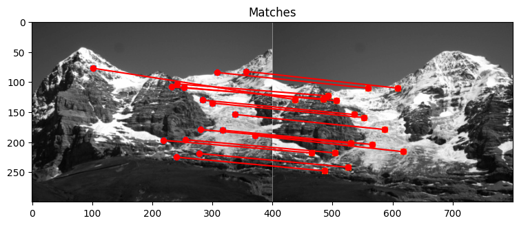

# Depth Reconstruction from Scratch

The first goal of this project is to provide a modular way to the 3D reconstruction problem. Any of the intermediate steps listed below can be replaced by different algorithms of the same task. The second goal is to write everything from scratch, i.e. using numpy only.

## Feature Matching

 - Corner detection (Shi-Tomasi)
 - Feature descriptor (Histogram of Oriented Gradients)
 - Finding feature correspondences

## Determine Relativ Transformation of Cameras (Direct Approach)

 - Computing fundamental matrix E from point correspondences using coplanarity constraint $x'^T E x'' = 0$
 - Solve least squares problem to find E
 - From E can recover R, T but not the scale

## Depth Reconstruction

 - Recover the scaling by again leveraging a linear sytem of $n$ equations:

$$  M \lambda = 0 \rightarrow  \min_{\lambda} || M \lambda ||^2 = \min_{\lambda} (M \lambda)^{\top} M \lambda \;\; s.t. \; |\lambda| = 1 $$

- Scaling is still only defined up to a global scale (cannot distinguish between camera having moved by $d$ or $2d$.)

## Future Extensions

- [ ] using an iterative approach (e.g. RANSAC) to obtain a probabilistically better E
- [ ] bundle adjustments -> going from a pair of images to n many images